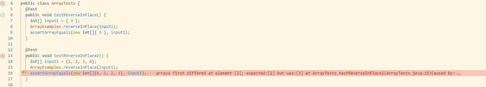

# **Lab Report 2**

## Part 1: 

```
### Code
import java.net.URI;
import java.io.IOException;

class Handler implements URLHandler {

    String runningString = new String();
    
    public String handleRequest(URI url) {
        
        if(url.getPath().contains("/add-message")){
            String[] parameter = url.getQuery().split("=");
            if (parameter[0].equals("s")) {
                runningString = runningString + "\n" + parameter[1];
            }
        }
        return runningString;
    }
}

class StringServer {
    public static void main(String[] args) throws IOException {
        if(args.length == 0){
            System.out.println("Missing port number! Try any number between 1024 to 49151");
            return;
        }

        int port = Integer.parseInt(args[0]);

        Server.start(port, new Handler());
    }
}
```
### Screenshot 1
 <br>

For this instance of `/add-message`, the method called is the handleRequest method. The argument passed into this method is the whole url, which was `http://localhost:4000/add-message?s=Hi%20my%20name%20is%20Owen`. The method goes into the first if-statement which checks if the url contains "/add-message". Since the url does, it then takes the query and checks for whether the query contains "s". It is then concatenated to the instance variable I named runningString, which is initially null.
### Screenshot 2
 <br>

For this instance of `/add-message`, the method called is handleRequest once again. The url `http://localhost:4000/add-message?s=What%27s%20your%20name?` is passed as an arhument. The relevant value here is runningString, which is currently "\n My name is Owen". runningString is changed by this specific request to "\n My name is Owen \n What's your name?"

## Part 2: 
### A failure-inducing input for reverseInPlace()
```
@Test
  public void testReverseInPlace2() {
    int[] input1 = {1, 2, 3, 4};
    ArrayExamples.reverseInPlace(input1);
    assertArrayEquals(new int[]{4, 3, 2, 1}, input1);
  }
 ```
 
 ### An input that doesn’t induce a failure
 ```
@Test 
	public void testReverseInPlace() {
    int[] input1 = { 3 };
    ArrayExamples.reverseInPlace(input1);
    assertArrayEquals(new int[]{ 3 }, input1);
	}
```

### The symptom



### The Bug
**Before**
```
static void reverseInPlace(int[] arr) {
    for(int i = 0; i < arr.length; i += 1) {
      arr[i] = arr[arr.length - i - 1];
    }
  }
```
**After**
```
static void reverseInPlace(int[] arr) {
    int[] newArray = new int[arr.length];
    for(int i = 0; i < arr.length; i++){
      newArray[i] = arr[i];
    }
    for(int i = 0; i < arr.length; i += 1) {
      arr[i] = newArray[arr.length - i - 1];
    }
  }
```
Initially, arr is copy elements from itself. This is an issue because by the time it iterates to the middle of the array, arr will be copying the new elements. To fix this, I created a copy array for arr to copy elements from.
