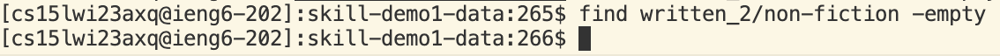

# **Lab Report 3**

## `find`
I will be focusing on the `find` command

**Command 1: `-empty`**
Searches for empty files and directories.

**Example 1**
Using `find written_2 -empty` will search from the directory written_2 any empty file/directory.
Since there are no empty files or directories within written_2, the command will return nothing.

